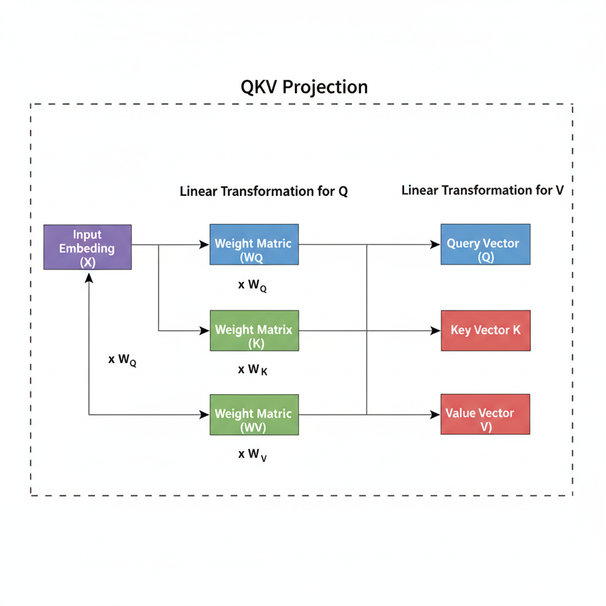
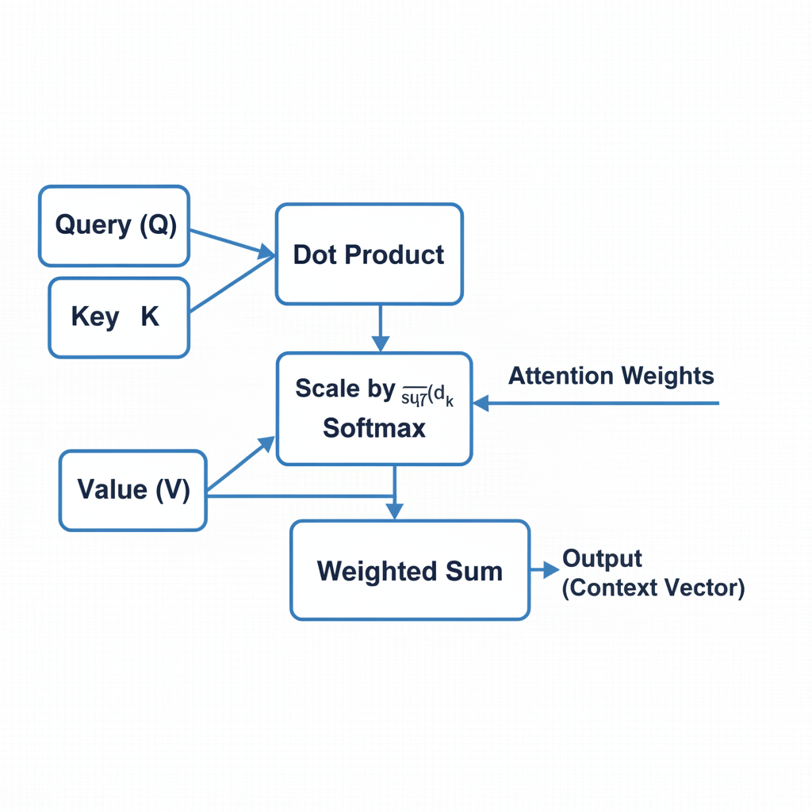
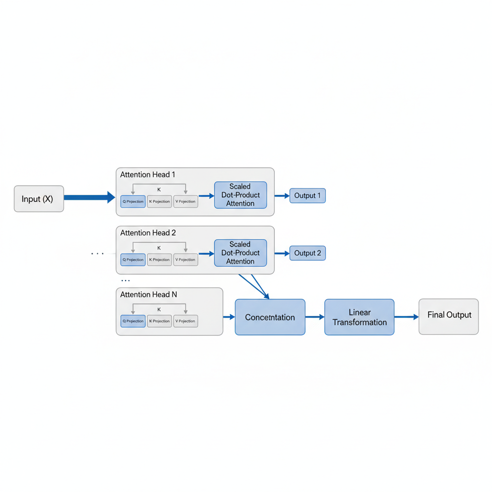

# Understanding Self-Attention: The Heart of Transformer Architecture

## Introduction to Transformers and the Need for Attention

The Transformer architecture has profoundly impacted the field of Natural Language Processing (NLP) and beyond, becoming the backbone for state-of-the-art models like BERT, GPT, and vision transformers. Its introduction marked a significant shift in how sequential data is processed, enabling unprecedented performance in tasks ranging from language translation to image recognition.

Prior to Transformers, Recurrent Neural Networks (RNNs) and their variants, such as Long Short-Term Memory (LSTMs), were dominant for sequential data. However, these models faced inherent limitations. They struggled with capturing long-range dependencies, often forgetting information from earlier parts of long sequences. Furthermore, their sequential processing nature made them slow, as each step depended on the previous one, hindering parallelization during training and inference.

Attention mechanisms were introduced to overcome these challenges. Conceptually, attention allows a model to dynamically weigh the importance of different parts of an input sequence when processing a specific element. This enables the model to focus on relevant information, regardless of its position or distance within the sequence, effectively addressing the long-range dependency problem and facilitating parallel computations across the input.

## What is Self-Attention? The Core Idea

Self-attention is a fundamental mechanism that empowers a model to weigh the importance of different words within the *same* input sequence when processing a specific word. This allows the model to capture dependencies and relationships between tokens regardless of their position or distance within the sequence.

To illustrate, consider the sentence: "The animal didn't cross the street because it was too tired." When the model processes the word "it," self-attention calculates an attention score for every other word in that sentence. It would assign a significantly higher attention score to "animal" than to "street" or "tired," thereby identifying that "it" refers to "animal." This internal scoring mechanism helps the model build a more contextually rich representation for each word.

Unlike traditional encoder-decoder attention (often referred to as cross-attention), which relates two different sequences (e.g., an input sequence to an output sequence in translation), self-attention operates exclusively *within* a single sequence. This intra-sequence focus is crucial for enhancing the contextual understanding of each element based on all other elements in the same input, forming the core of Transformer models' power.

## The Query, Key, and Value (QKV) Mechanism

At the core of self-attention is the Query, Key, and Value (QKV) mechanism, which dictates how tokens interact and weigh each other's importance. This mechanism can be understood through an analogy to information retrieval:
*   A **Query (Q)** represents "what I'm looking for" or the information a token wants to find in others.
*   A **Key (K)** represents "what I have" or the identifying characteristic of a token that others might be looking for.
*   A **Value (V)** represents "what I'll give you if we match" or the actual information content a token offers.

For each token in the input sequence, its initial embedding is independently transformed into three distinct vectors: a Query vector (Q), a Key vector (K), and a Value vector (V). This transformation is achieved by multiplying the input embedding with three separate, learnable weight matrices: `W^Q`, `W^K`, and `W^V`. These weight matrices are unique for each attention head and are learned during the training process.


*The Query, Key, and Value (QKV) Projection. Each input token's embedding is transformed into three distinct vectors (Q, K, V) through separate linear transformations with learned weight matrices (W_Q, W_K, W_V).*

The resulting Q and K vectors typically share the same dimension (`d_k`), as their primary purpose is to be compared against each other to compute similarity scores. The V vector, on the other hand, carries the actual semantic content of the token and can have a different dimension (`d_v`). The attention mechanism uses the Q of one token to query the K of all other tokens (including itself) to determine relevance, then aggregates the V vectors of relevant tokens based on these computed similarities.

## Calculating Self-Attention Scores: Scaled Dot-Product Attention

The core of the self-attention mechanism lies in calculating how much each word in a sequence should "attend" to every other word. This process, often referred to as scaled dot-product attention, involves several distinct steps to derive context-aware representations.


*The Scaled Dot-Product Attention Mechanism. This diagram shows the four main steps: computing raw attention scores via Q and K dot product, scaling by `sqrt(d_k)`, applying softmax to get attention weights, and finally, computing the output context vector by weighting the Value vectors.*

1.  **Compute Raw Attention Scores:** For a given word's Query (Q) vector, its dot product is calculated with the Key (K) vector of every word in the input sequence. This dot product operation measures the similarity or relevance between the query word and each key word, resulting in raw attention scores. A higher score indicates greater potential influence.

2.  **Scale Dot Products:** These raw attention scores are then scaled by dividing them by the square root of the key vector's dimension, `sqrt(d_k)`. This scaling factor is crucial for stabilizing the training process. Without it, especially with large `d_k`, dot products can become excessively large, pushing the softmax function into regions with very small gradients, which can hinder effective learning.

3.  **Apply Softmax Function:** A softmax function is applied to the scaled scores. This converts the scores into attention weights, which are positive values that sum up to 1. These weights represent a probability distribution, indicating the relative importance or "attention" the current query word should give to each word in the sequence.

4.  **Compute Context Vector:** Finally, each attention weight is multiplied by its corresponding Value (V) vector. These weighted Value vectors are then summed together to produce a single output vector for the original query word. This output vector is a new, context-aware embedding that aggregates information from all words in the sequence, weighted by their computed relevance.

## Multi-Head Attention: Enhancing Representation Power

Instead of performing a single self-attention operation, Multi-Head Attention employs `h` distinct "attention heads." The input queries, keys, and values are linearly projected `h` times into different, lower-dimensional representation subspaces. Each of these projected sets then undergoes an independent self-attention calculation. This effectively allows the model to process the same input data from `h` different perspectives simultaneously.


*Multi-Head Attention. The input is projected into multiple subspaces, allowing 'h' independent attention heads to process information in parallel. Their outputs are then concatenated and linearly transformed to produce the final output.*

This parallel processing is crucial because it enables the model to jointly attend to information from various representation subspaces at different positions. Each head can specialize in capturing different types of relationships within the input sequence. For instance, one head might focus on syntactic dependencies, while another identifies semantic similarities or long-range contextual connections. This diverse aggregation of perspectives significantly enhances the model's ability to capture rich and varied semantic and syntactic relationships present in the data.

After each head computes its independent attention output, these `h` individual output matrices are concatenated along their dimension. This combined, wider matrix represents the aggregate information from all heads. Finally, this concatenated output undergoes a final linear transformation. This transformation projects the combined representation back into the original desired output dimension, forming a single, richer context vector that encapsulates the diverse insights gathered by all attention heads.

## Positional Encoding: Preserving Sequence Order

Self-attention mechanisms, a core component of Transformers, process all input tokens simultaneously. This parallel processing is highly efficient but comes with a crucial drawback: it inherently discards the sequential order of tokens. Without any additional information, the model cannot distinguish between "the dog bit the man" and "the man bit the dog," as the relationships between individual words would be considered purely based on their content, not their position within the sequence.

To overcome this limitation, Transformers introduce *positional encodings*. These are vectors that carry information about the position of each token in the sequence. The most common approach involves adding fixed sine and cosine functions of varying frequencies to the input embeddings before they enter the attention layers. This method allows for unique encoding of each position, and importantly, enables the model to generalize to sequence lengths longer than those seen during training.

By directly adding these positional encoding vectors to the token embeddings, the model receives a modified representation that now contains both semantic content and positional information. This allows the self-attention layers to infer the relative positions between tokens. Consequently, the Transformer can understand how word order contributes to the overall meaning and contextual understanding, making it sensitive to sequence structure despite its permutation-invariant attention mechanism.

## Performance and Cost Considerations

The self-attention mechanism, while powerful, introduces significant computational and memory overheads, especially when dealing with long input sequences. Understanding these implications is crucial for efficient model design and deployment.

Computationally, the dominant cost of self-attention stems from the calculation of attention scores. For a sequence of length N (number of tokens) and an embedding dimension d, the process involves matrix multiplications that result in a quadratic computational complexity, often expressed as O(N^2 * d). This N^2 dependency arises because each token must compute its attention score with every other token in the sequence. For training, this translates to longer training times and higher energy consumption. During inference, it can lead to increased latency and reduced throughput, particularly with longer inputs.

Memory usage is another critical factor. Storing the Query (Q), Key (K), and Value (V) matrices, each typically of size N x d, along with the resulting attention score matrix (N x N) and the final context vector, can quickly consume available GPU memory. For very long sequences or large batch sizes, this memory footprint becomes a significant bottleneck, often necessitating smaller batch sizes or distributed computing setups.

To mitigate these scaling challenges, various techniques and architectural modifications have been proposed. These include methods like sparse attention patterns, which limit the number of token-to-token interactions; local attention, which restricts attention to a fixed window of neighboring tokens; and specialized architectures such as Longformer or Reformer. The primary goal of these innovations is to reduce the quadratic N^2 dependency to a more manageable linear or near-linear relationship with sequence length, thereby enabling the processing of much longer sequences.

## Debugging Self-Attention: Visualizing What the Model "Sees"

Interpreting the internal workings of self-attention is crucial for debugging Transformer models. A primary approach involves extracting attention weights from a trained model, which are typically available as outputs from attention layers. These weights, often represented as matrices, quantify how much each token in a sequence "attends" to every other token. Visualizing these matrices as heatmaps provides an intuitive understanding: rows represent query tokens, columns represent key tokens, and the intensity of a cell indicates the attention strength. This allows developers to see which input tokens contribute most significantly to the representation of others, especially for specific predictions.

Through such visualizations, common issues can be identified. For instance, attention might excessively focus on padding tokens, indicating wasted computation or a failure to learn meaningful context. Another problem is "over-smoothing," where attention weights are uniformly distributed across many tokens, suggesting the model isn't effectively prioritizing important relationships. Conversely, the model might fail to capture expected long-range dependencies, with attention remaining localized despite distant tokens being semantically related.

To gain deeper insights, tools like custom visualization scripts using libraries such as Matplotlib or Seaborn are invaluable for generating detailed heatmaps. While TensorBoard's projector is excellent for embedding visualization, specific attention visualization plugins or custom scripts are often preferred for attention. It's critical to inspect attention patterns across different layers of the Transformer, as attention evolves from lower-level syntactic relationships to higher-level semantic ones. Furthermore, analyzing multiple attention heads is vital, as each head often learns distinct types of relationships, offering a comprehensive view of the model's decision-making process.

## Minimal Code Sketch for Self-Attention

To solidify the understanding of self-attention, let's walk through a simplified implementation using NumPy. This sketch focuses on the core mathematical operations and tensor manipulations, illustrating how an input sequence's embeddings are transformed into an attention-weighted output. We'll define `d_model` as the dimension of the input embeddings, `d_k` as the dimension of the Query and Key vectors, and `d_v` as the dimension of the Value vectors.

```python
import numpy as np

def minimal_self_attention(input_embeddings, d_model, d_k, d_v):
    """
    A minimal NumPy implementation of the self-attention mechanism.

    Args:
        input_embeddings (np.array): Input sequence of embeddings (seq_len, d_model).
        d_model (int): Dimension of input embeddings.
        d_k (int): Dimension of Query and Key vectors.
        d_v (int): Dimension of Value vectors.

    Returns:
        np.array: Output of the self-attention mechanism (seq_len, d_v).
    """
    seq_len, _ = input_embeddings.shape

    # 1. Linear Projections for Q, K, V
    # Each input embedding is projected into three different spaces:
    # Query (Q), Key (K), and Value (V). These projections are done via
    # learned weight matrices (W_q, W_k, W_v).
    W_q = np.random.rand(d_model, d_k) # Shape: (d_model, d_k)
    W_k = np.random.rand(d_model, d_k) # Shape: (d_model, d_k)
    W_v = np.random.rand(d_model, d_v) # Shape: (d_model, d_v)

    # Perform matrix multiplications:
    # (seq_len, d_model) @ (d_model, d_k) -> (seq_len, d_k)
    Q = input_embeddings @ W_q
    K = input_embeddings @ W_k
    V = input_embeddings @ W_v

    print(f"Shapes after projections: Q={Q.shape}, K={K.shape}, V={V.shape}\n")

    # 2. Calculate Attention Scores
    # The core attention mechanism begins with dot products between Queries and Keys.
    # This measures the "similarity" or "relevance" of each query to each key.
    # (seq_len, d_k) @ (d_k, seq_len) -> (seq_len, seq_len)
    attention_scores = Q @ K.T
    print(f"Shape after Q @ K.T: {attention_scores.shape}\n")

    # Scale the scores to prevent the softmax function from having extremely small
    # gradients, which can happen with large d_k values.
    # (seq_len, seq_len) / scalar -> (seq_len, seq_len)
    scaled_attention_scores = attention_scores / np.sqrt(d_k)
    print(f"Shape after scaling: {scaled_attention_scores.shape}\n")

    # Apply softmax to convert scores into probabilities (attention weights).
    # Softmax is applied row-wise, ensuring each row sums to 1.
    # (seq_len, seq_len) -> (seq_len, seq_len)
    exp_scores = np.exp(scaled_attention_scores - np.max(scaled_attention_scores, axis=-1, keepdims=True))
    attention_weights = exp_scores / np.sum(exp_scores, axis=-1, keepdims=True)
    print(f"Shape after softmax (attention weights): {attention_weights.shape}\n")

    # 3. Weighted Sum of Value Vectors
    # Finally, these attention weights are used to compute a weighted sum of the
    # Value vectors. This combines information from all input positions,
    # weighted by their relevance to the current query.
    # (seq_len, seq_len) @ (seq_len, d_v) -> (seq_len, d_v)
    output = attention_weights @ V
    print(f"Final output shape: {output.shape}\n")

    return output

# Example Usage:
# Let's consider a sequence of 3 tokens, where each token has an embedding dimension of 4.
# We'll set d_k (Query/Key dimension) and d_v (Value dimension) to 2.
seq_len_example = 3
d_model_example = 4
d_k_example = 2
d_v_example = 2
input_data_example = np.random.rand(seq_len_example, d_model_example) # Example input embeddings

print(f"Input embeddings shape: {input_data_example.shape}\n")
output_attention_example = minimal_self_attention(input_data_example, d_model_example, d_k_example, d_v_example)
```