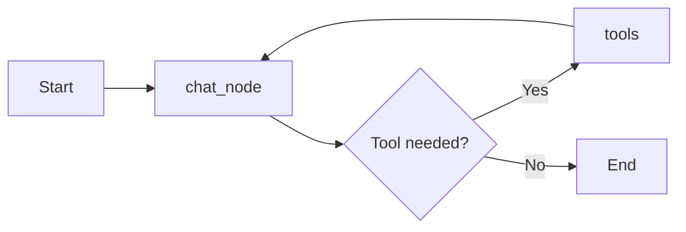

# Chatbot Technical Feature Document

## 1. Brief Overview

This chatbot is a stateful conversational AI application built using Python, LangGraph, Streamlit, and Google Gemini. It combines a backend workflow engine with a frontend web interface to provide a multi-turn chat experience where each conversation is preserved in a thread and can be revisited later.

The system is designed around two core components:

- a LangGraph backend that manages the conversation workflow and invokes the LLM,
- a Streamlit frontend that presents the chat UI, stores session state, and manages conversation history.

The backend now runs fully asynchronously on a dedicated background event loop, which allows it to integrate tools served over the Model Context Protocol (MCP) — including a local MCP calculator server — alongside its built-in tools.

The chatbot is intended for interactive use, persistent conversation tracking, thread-based continuity across sessions, and tool-augmented reasoning that combines local, in-process tools with externally hosted MCP tools.

---

## 2. High-Level Architecture

The application follows a simple three-layer architecture:

1. User Interface Layer
   - Built with Streamlit.
   - Handles message input, chat display, and thread navigation.

2. Workflow Layer
   - Built with LangGraph.
   - Defines the chatbot state machine and routes user messages to the language model.
   - Runs entirely on a dedicated background asyncio event loop so it can natively support async-only MCP tools.

3. AI and Persistence Layer
   - Uses Gemini via LangChain integration.
   - Stores ongoing state in a SQLite database through LangGraph's async checkpointing (AsyncSqliteSaver).
   - Connects to a local MCP server (stdio transport) to expose additional tools to the model.

### Figure: System Visual

> The image in the project folder serves as the visual reference for the chatbot's overall flow and interface concept.

---

## 3. Core Features

### 3.1 Stateful Conversational Workflow

The chatbot is not a one-shot prompt system. It maintains a conversation state that evolves across turns.

Features:

- tracks the conversation as a sequence of messages,
- preserves context across user inputs,
- allows multi-turn interaction with the language model.

This is implemented through the ChatState structure, which stores a list of messages and uses the LangGraph add_messages reducer.

### 3.2 Thread-Based Conversation Management

Each chat interaction is associated with a unique thread ID. This allows the system to separate one conversation from another and continue the correct history.

Features:

- creates a unique thread for each chat session,
- stores message history under that thread,
- allows the user to revisit old conversations.

### 3.3 Persistent Memory with SQLite

The backend uses async SQLite persistence via AsyncSqliteSaver (backed by aiosqlite) so that conversation checkpoints are saved and retrievable.

Features:

- saves checkpoints for each conversation thread,
- prevents the loss of history across refreshes or restarts,
- enables later retrieval of messages from previous sessions,
- performs all database reads/writes asynchronously on the backend's dedicated event loop, keeping them consistent with the async graph execution and async MCP tool calls.

### 3.4 LangGraph-Based Execution Flow

The chatbot uses a LangGraph workflow that supports both conversational responses and tool execution.

Workflow:

- START → chat_node
- chat_node → tools (when the model decides a tool is needed)
- tools → chat_node

This allows the chatbot to perform actions such as web search, arithmetic (via the MCP calculator server), or stock lookup during a conversation and then continue with the updated context. The graph is compiled and executed entirely through its async API (ainvoke/astream), which is required because MCP tools only implement asynchronous execution.

### 3.5 LLM Integration with Gemini

The backend connects to Google's Gemini model using ChatGoogleGenerativeAI.

Features:

- sends the conversation history to the model,
- generates assistant responses based on the latest input,
- binds tool definitions — including dynamically discovered MCP tools — to the model so it can decide when to invoke them,
- uses a modern generative model suitable for conversational interaction and lightweight agent workflows.

### 3.6 Streaming Responses

The frontend uses a synchronous bridge over the backend's async streaming API to display the assistant's response progressively.

Features:

- makes the experience feel more interactive,
- shows output as it is generated,
- improves user engagement during longer responses,
- filters out intermediate tool-related messages from the main text stream while still surfacing tool activity through dedicated status indicators,
- relays chunks from the backend's dedicated async event loop (running in a background thread) to Streamlit's main thread via a queue-based generator, so the UI code can consume streamed output with a plain synchronous `for` loop.

### 3.7 Sidebar Conversation Browser

The Streamlit sidebar provides a conversation list that helps users switch between chats quickly.

Features:

- shows previous conversations in a readable list,
- displays a short preview of the last user message,
- enables quick access to old dialogue threads.

### 3.8 Create New Chat Functionality

Users can start a fresh conversation at any time.

Features:

- generates a new thread ID,
- clears the current in-memory chat history,
- registers the new thread for future access.

### 3.9 Session-Based Frontend State Handling

The frontend uses Streamlit session state to manage data across interaction cycles.

Features:

- preserves the current thread ID,
- preserves chat history in the browser session,
- ensures UI updates remain consistent during interaction.

### 3.10 Message History Rendering

The interface renders prior messages from the session state into the chat view.

Features:

- shows the full conversation history in order,
- differentiates between user and assistant messages,
- maintains a coherent chat experience,
- preserves the final assistant answer cleanly even when the underlying workflow uses tools internally,
- reconstructs and displays past tool calls (name, input, output) alongside the assistant's reply when a saved thread is reloaded.

### 3.11 Tool-Enabled Conversations

The chatbot now supports tool-augmented interactions through LangGraph, combining locally defined tools with tools served over MCP.

Available tools include:

- a calculator, now served via a local MCP server (stdio transport) rather than an in-process function, discovered dynamically at startup through the MCP client,
- a stock price lookup tool for market data,
- a web search tool for general information retrieval.

This makes the assistant more capable for queries that require external information or computation, and demonstrates how the graph can incorporate tools hosted outside the main application process.

### 3.12 MCP Tool Integration

The backend connects to an external Model Context Protocol server to source the calculator tool, rather than implementing it as a local Python function.

Features:

- uses MultiServerMCPClient to manage one or more MCP server connections (currently a local stdio-based calculator server),
- discovers available MCP tools dynamically at startup via an async `get_tools()` call,
- merges MCP-provided tools with the local tool set (search and stock lookup) before binding them to the model,
- fails gracefully by falling back to an empty MCP tool list if the MCP server cannot be reached, rather than crashing the whole application.

### 3.13 Dedicated Background Event Loop

Because MCP tools only support asynchronous execution, the backend runs its entire LangGraph workflow — LLM calls, tool calls, and checkpointing — on a single dedicated asyncio event loop, hosted in a background daemon thread that starts when the backend module is imported.

Features:

- provides one consistent event loop for the lifetime of the application, so the MCP client's stdio subprocess and session remain valid across requests,
- exposes `run_async` (blocking) and `submit_async_task` (non-blocking) helpers so synchronous code, such as the Streamlit frontend, can safely drive async backend operations,
- avoids the "event loop is closed" and "attached to a different loop" failures that can occur when a fresh event loop is created and torn down on every call.

---

## 4. Backend Features Explained

The backend logic is contained in the file chat_bot_langgraph_backend.py.

### 4.1 Environment Configuration

The script loads environment variables from a .env file and sets the LangChain project name for observability.

Why it matters:

- enables environment-based configuration,
- supports observability and experiment tracking,
- makes deployment and testing easier.

### 4.2 Typed Conversation State

The ChatState class defines the state structure used by LangGraph.

The state contains a list of messages, and the add_messages reducer ensures message histories are accumulated correctly across graph execution.

### 4.3 LLM Node

The chat_node function is the main execution node.

Responsibilities:

- reads messages from the current state,
- sends them asynchronously to the Gemini model via `ainvoke`,
- returns the model response as a new message entry.

chat_node is defined as an `async def` function, which is required for the graph to run through LangGraph's async execution path — the only path compatible with MCP tools, which do not support synchronous invocation.

### 4.4 Graph Construction

A StateGraph is created and populated with a chat node, a tool node, and conditional routing:

- START → chat_node
- chat_node → tools when the model requests a tool call
- tools → chat_node after the tool result is returned

This defines a simple but functional graph for chatbot execution with optional tool use. The compiled graph is invoked exclusively through its async interface (`ainvoke`/`astream`).

### 4.5 Checkpointing and Persistence

The backend connects to SQLite asynchronously using aiosqlite and wraps the connection with AsyncSqliteSaver.

This gives the chatbot durability and the ability to restore conversations based on thread IDs, while keeping all database I/O on the same async event loop as the rest of the graph execution.

### 4.6 Tool Integration

The backend binds three tools to the Gemini model:

- a calculator tool, sourced from a local MCP server via MultiServerMCPClient and discovered at startup,
- a stock price lookup tool for financial data,
- a DuckDuckGo search tool for web information.

These tools are exposed through LangChain tool definitions and routed through the graph using ToolNode and tools_condition. MCP-sourced tools are merged into the same `tools` list as the locally defined tools, so the model and ToolNode treat them uniformly.

### 4.7 Thread Retrieval Utility

The retrieve_all_threads function collects all known thread IDs from the checkpoint store.

This allows the frontend to populate the conversation list from saved data. Internally it runs the async `alist` checkpoint iterator on the backend's dedicated event loop via `run_async`, and returns a plain list to the (synchronous) frontend.

### 4.8 Dedicated Async Event Loop and Helpers

The backend starts a background thread running its own asyncio event loop as soon as the module is imported.

Responsibilities:

- `run_async(coro)` submits a coroutine to the background loop and blocks until it completes, returning the result — used for startup tasks (loading MCP tools, initializing the checkpointer) and for `retrieve_all_threads`,
- `submit_async_task(coro)` submits a coroutine to the background loop without blocking, returning a future — used by the frontend's streaming bridge to drive `chatbot.astream(...)` from a synchronous context,
- this single persistent loop ensures the MCP client's stdio subprocess and session, opened once at startup, remain usable for the lifetime of the application.

---

## 5. Frontend Features Explained

The frontend logic is contained in the file chatbot_streamlit_frontend_streaming.py.

### 5.1 UUID-Based Thread Generation

Each chat session receives a unique thread ID generated using Python's uuid module.

Purpose:

- ensures each chat is independently trackable,
- prevents collisions between conversation histories.

### 5.2 New Chat Reset Function

The reset_chat function creates a fresh thread and clears the current message history.

This gives the user a clean starting point when needed.

### 5.3 Conversation List Management

The app stores all visible threads in the Streamlit session state and appends new ones when necessary.

This makes the conversation selection experience dynamic and responsive.

### 5.4 Conversation Reloading

When a user clicks an old conversation from the sidebar, the app loads its stored messages from the chatbot state and rehydrates the UI, including any tool calls made during that conversation.

Benefits:

- supports history browsing,
- restores previous context,
- feels like a real chat application rather than a stateless prompt tool.

### 5.5 Preview of Previous User Questions

The app shows a short preview of the last user message in each conversation to make the sidebar easier to scan.

This is a usability enhancement that improves navigation and user experience.

### 5.6 Chat Input and Message Rendering

The frontend collects the current user input and displays it immediately in the chat interface before the assistant responds.

This creates a familiar chat experience with visible turn-by-turn interaction.

### 5.7 Streaming Assistant Output via Async Bridge

The assistant reply is streamed into the UI token-by-token, sourced from the backend's async `chatbot.astream(...)` call.

Features:

- since the backend's graph now runs only on its dedicated background event loop, the frontend uses a `stream_sync` helper that submits `chatbot.astream(...)` to that loop via `submit_async_task` and relays each streamed chunk back to Streamlit's main thread through a queue,
- this lets the rest of the frontend's streaming logic remain a plain synchronous `for message_chunk, metadata in ...:` loop, unchanged in shape from the original synchronous implementation,
- provides real-time feedback and makes the response feel more natural,
- the stream is filtered so that internal tool-related messages do not appear in the main text output; instead, tool calls (including those served via MCP) are rendered as live-updating status boxes showing the tool name, input arguments, and output,
- exceptions raised during streaming (including from the background loop) are propagated back through the queue and surfaced to the user via `st.error`/`st.exception` rather than failing silently.

---

## 6. Graph Diagram

The backend workflow can be represented as follows:

This graph shows the chatbot's execution flow:

- the workflow starts,
- the chat node processes the message,
- the model may decide to call a tool — a local tool (search, stock lookup) or an MCP-hosted tool (calculator),
- the tool result is sent back to the chat node,
- the workflow completes once the final answer is produced.

The entire flow, including any MCP tool calls, executes on the backend's dedicated asyncio event loop.

---

## 7. Data Flow Summary

A typical interaction follows this path:

1. The user enters a message in the Streamlit interface.
2. The message is appended to the current session history.
3. The frontend builds a configuration object containing the current thread ID.
4. The frontend's `stream_sync` helper submits an async streaming call to the backend's dedicated event loop (running in a background thread) and begins relaying chunks back through a queue.
5. The backend executes the LangGraph workflow asynchronously. The chat node sends the conversation to Gemini, which may decide to invoke a tool.
6. If a tool is required, the call is routed to either a local tool or, for the calculator, the MCP server process over stdio; the tool result is routed back into the chat node for follow-up reasoning.
7. The final assistant reply is streamed back to the UI without showing internal tool messages, while tool activity is shown separately via status indicators.
8. The response is added to the conversation history and preserved in state, asynchronously persisted to SQLite via AsyncSqliteSaver.

---

## 8. Practical Benefits of the System

This chatbot provides several practical advantages:

- conversational continuity across turns,
- support for multiple independent chat threads,
- persistence of messages for later review,
- a polished end-user interface,
- extensibility for future features such as retrieval, multi-step agent workflows, and richer tool orchestration,
- the ability to plug in additional MCP servers (local or remote, stdio or HTTP-based) as new tool sources without changing the core graph structure.

---

## 9. Summary

The chatbot is a lightweight but technically solid AI assistant application that integrates:

- LangGraph for workflow orchestration, running fully asynchronously,
- Gemini for language generation,
- Streamlit for interaction, bridged to the backend's async execution via a queue-based streaming helper,
- SQLite (async, via AsyncSqliteSaver) for persistence,
- thread-based state handling for continuity,
- tool-augmented reasoning for external information and computation, combining local tools with tools served over the Model Context Protocol.

It is well-suited as a tutorial project, a starter application for agent-based chat systems, or a foundation for more advanced chatbot features, including further MCP server integrations.
