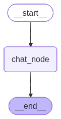
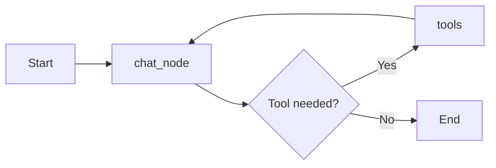

# Chatbot Technical Feature Document

## 1. Brief Overview

This chatbot is a stateful conversational AI application built using Python, LangGraph, Streamlit, and Google Gemini. It combines a backend workflow engine with a frontend web interface to provide a multi-turn chat experience where each conversation is preserved in a thread and can be revisited later.

The system is designed around two core components:

- a LangGraph backend that manages the conversation workflow and invokes the LLM,
- a Streamlit frontend that presents the chat UI, stores session state, and manages conversation history.

The chatbot is intended for interactive use, persistent conversation tracking, thread-based continuity across sessions, and simple tool-augmented reasoning.

---

## 2. High-Level Architecture

The application follows a simple three-layer architecture:

1. User Interface Layer
   - Built with Streamlit.
   - Handles message input, chat display, and thread navigation.

2. Workflow Layer
   - Built with LangGraph.
   - Defines the chatbot state machine and routes user messages to the language model.

3. AI and Persistence Layer
   - Uses Gemini via LangChain integration.
   - Stores ongoing state in a SQLite database through LangGraph checkpointing.

### Figure: System Visual

> The image in the project folder serves as the visual reference for the chatbot’s overall flow and interface concept.

---

## 3. Core Features

### 3.1 Stateful Conversational Workflow

The chatbot is not a one-shot prompt system. It maintains a conversation state that evolves across turns.

Features:

- tracks the conversation as a sequence of messages,
- preserves context across user inputs,
- allows multi-turn interaction with the language model.

This is implemented through the ChatState structure, which stores a list of messages and uses the LangGraph add_messages reducer.

### 3.2 Thread-Based Conversation Management

Each chat interaction is associated with a unique thread ID. This allows the system to separate one conversation from another and continue the correct history.

Features:

- creates a unique thread for each chat session,
- stores message history under that thread,
- allows the user to revisit old conversations.

### 3.3 Persistent Memory with SQLite

The backend uses SQLite persistence via SqliteSaver so that conversation checkpoints are saved and retrievable.

Features:

- saves checkpoints for each conversation thread,
- prevents the loss of history across refreshes or restarts,
- enables later retrieval of messages from previous sessions.

### 3.4 LangGraph-Based Execution Flow

The chatbot uses a LangGraph workflow that supports both conversational responses and tool execution.

Workflow:

- START → chat_node
- chat_node → tools (when the model decides a tool is needed)
- tools → chat_node

This allows the chatbot to perform actions such as web search, arithmetic, or stock lookup during a conversation and then continue with the updated context.

### 3.5 LLM Integration with Gemini

The backend connects to Google’s Gemini model using ChatGoogleGenerativeAI.

Features:

- sends the conversation history to the model,
- generates assistant responses based on the latest input,
- binds tool definitions to the model so it can decide when to invoke them,
- uses a modern generative model suitable for conversational interaction and lightweight agent workflows.

### 3.6 Streaming Responses

The frontend uses Streamlit’s streaming capability to display the assistant’s response progressively.

Features:

- makes the experience feel more interactive,
- shows output as it is generated,
- improves user engagement during longer responses,
- filters out intermediate tool-related messages so the user only sees the final assistant response.

### 3.7 Sidebar Conversation Browser

The Streamlit sidebar provides a conversation list that helps users switch between chats quickly.

Features:

- shows previous conversations in a readable list,
- displays a short preview of the last user message,
- enables quick access to old dialogue threads.

### 3.8 Create New Chat Functionality

Users can start a fresh conversation at any time.

Features:

- generates a new thread ID,
- clears the current in-memory chat history,
- registers the new thread for future access.

### 3.9 Session-Based Frontend State Handling

The frontend uses Streamlit session state to manage data across interaction cycles.

Features:

- preserves the current thread ID,
- preserves chat history in the browser session,
- ensures UI updates remain consistent during interaction.

### 3.10 Message History Rendering

The interface renders prior messages from the session state into the chat view.

Features:

- shows the full conversation history in order,
- differentiates between user and assistant messages,
- maintains a coherent chat experience,
- preserves the final assistant answer cleanly even when the underlying workflow uses tools internally.

### 3.11 Tool-Enabled Conversations

The chatbot now supports tool-augmented interactions through LangGraph.

Available tools include:

- a calculator for arithmetic tasks,
- a stock price lookup tool for market data,
- a web search tool for general information retrieval.

This makes the assistant more capable for queries that require external information or computation.

---

## 4. Backend Features Explained

The backend logic is contained in the file chat_bot_langgraph_backend.py.

### 4.1 Environment Configuration

The script loads environment variables from a .env file and sets the LangChain project name for observability.

Why it matters:

- enables environment-based configuration,
- supports observability and experiment tracking,
- makes deployment and testing easier.

### 4.2 Typed Conversation State

The ChatState class defines the state structure used by LangGraph.

The state contains a list of messages, and the add_messages reducer ensures message histories are accumulated correctly across graph execution.

### 4.3 LLM Node

The chat_node function is the main execution node.

Responsibilities:

- reads messages from the current state,
- sends them to the Gemini model,
- returns the model response as a new message entry.

### 4.4 Graph Construction

A StateGraph is created and populated with a chat node, a tool node, and conditional routing:

- START → chat_node
- chat_node → tools when the model requests a tool call
- tools → chat_node after the tool result is returned

This defines a simple but functional graph for chatbot execution with optional tool use.

### 4.5 Checkpointing and Persistence

The backend connects to SQLite and wraps the database with SqliteSaver.

This gives the chatbot durability and the ability to restore conversations based on thread IDs.

### 4.6 Tool Integration

The backend binds three tools to the Gemini model:

- a calculator tool for basic arithmetic,
- a stock price lookup tool for financial data,
- a DuckDuckGo search tool for web information.

These tools are exposed through LangChain tool definitions and routed through the graph using ToolNode and tools_condition.

### 4.7 Thread Retrieval Utility

The retrieve_all_threads function collects all known thread IDs from the checkpoint store.

This allows the frontend to populate the conversation list from saved data.

---

## 5. Frontend Features Explained

The frontend logic is contained in the file chatbot_streamlit_frontend_streaming.py.

### 5.1 UUID-Based Thread Generation

Each chat session receives a unique thread ID generated using Python’s uuid module.

Purpose:

- ensures each chat is independently trackable,
- prevents collisions between conversation histories.

### 5.2 New Chat Reset Function

The reset_chat function creates a fresh thread and clears the current message history.

This gives the user a clean starting point when needed.

### 5.3 Conversation List Management

The app stores all visible threads in the Streamlit session state and appends new ones when necessary.

This makes the conversation selection experience dynamic and responsive.

### 5.4 Conversation Reloading

When a user clicks an old conversation from the sidebar, the app loads its stored messages from the chatbot state and rehydrates the UI.

Benefits:

- supports history browsing,
- restores previous context,
- feels like a real chat application rather than a stateless prompt tool.

### 5.5 Preview of Previous User Questions

The app shows a short preview of the last user message in each conversation to make the sidebar easier to scan.

This is a usability enhancement that improves navigation and user experience.

### 5.6 Chat Input and Message Rendering

The frontend collects the current user input and displays it immediately in the chat interface before the assistant responds.

This creates a familiar chat experience with visible turn-by-turn interaction.

### 5.7 Streaming Assistant Output

The assistant reply is streamed into the UI using Streamlit’s write_stream function.

This provides real-time feedback and makes the response feel more natural. The stream is filtered so that internal tool-related messages do not appear to the user, leaving a cleaner chat experience.

---

## 6. Graph Diagram

The backend workflow can be represented as follows:

This updated graph shows the chatbot’s execution flow:

- the workflow starts,
- the chat node processes the message,
- the model may decide to call a tool,
- the tool result is sent back to the chat node,
- the workflow completes once the final answer is produced.

---

## 7. Data Flow Summary

A typical interaction follows this path:

1. The user enters a message in the Streamlit interface.
2. The message is appended to the current session history.
3. The frontend builds a configuration object containing the current thread ID.
4. The backend executes the LangGraph workflow.
5. The chat node sends the conversation to Gemini, which may decide to invoke a tool.
6. If a tool is required, the tool result is routed back into the chat node for follow-up reasoning.
7. The final assistant reply is streamed back to the UI without showing internal tool messages.
8. The response is added to the conversation history and preserved in state.

---

## 8. Practical Benefits of the System

This chatbot provides several practical advantages:

- conversational continuity across turns,
- support for multiple independent chat threads,
- persistence of messages for later review,
- a polished end-user interface,
- extensibility for future features such as retrieval, multi-step agent workflows, and richer tool orchestration.

---

## 9. Summary

The chatbot is a lightweight but technically solid AI assistant application that integrates:

- LangGraph for workflow orchestration,
- Gemini for language generation,
- Streamlit for interaction,
- SQLite for persistence,
- thread-based state handling for continuity,
- tool-augmented reasoning for external information and computation.

It is well-suited as a tutorial project, a starter application for agent-based chat systems, or a foundation for more advanced chatbot features.
