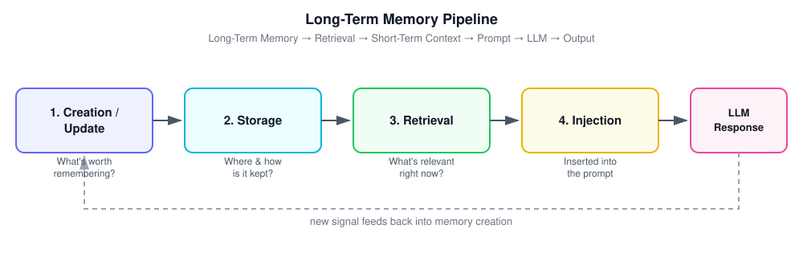

# LLM Memory: A Guide to Memory Systems in Generative & Agentic AI

> A practical breakdown of why LLMs need memory, the types of memory used in modern AI systems, and how memory pipelines actually work under the hood.

---

## Table of Contents

1. [The Core Problem: LLMs Are Stateless](#1-the-core-problem-llms-are-stateless)
2. [Context Window & In-Context Learning](#2-context-window--in-context-learning)
3. [Short-Term Memory](#3-short-term-memory)
4. [Why We Need a New Kind of Memory](#4-why-we-need-a-new-kind-of-memory)
5. [Long-Term Memory](#5-long-term-memory)
6. [Types of Long-Term Memory](#6-types-of-long-term-memory)
7. [How Long-Term Memory Works](#7-how-long-term-memory-works)
8. [Common Tools & Frameworks](#8-common-tools--frameworks)
9. [Key Challenges](#9-key-challenges)
10. [Summary](#10-summary)

---

## 1. The Core Problem: LLMs Are Stateless

An LLM at inference time is fundamentally a **parameterized math function**. Given an input, it produces an output based on a fixed set of trained weights. It does not update those weights during a conversation, and it does not retain anything once the process finishes.

> **A system is stateless if its output depends only on the current input, not on anything that happened before.**

This means LLMs have **no intrinsic memory**. Every time you send a prompt, the model has no built-in awareness of prior interactions unless that information is explicitly re-supplied to it as part of the input. Any sense of "memory" you experience while chatting with an LLM is actually an illusion created by an external system re-feeding relevant history back into the prompt.

This is the foundational reason memory architectures exist at all: **if the model itself can't remember, something around the model has to.**

---

## 2. Context Window & In-Context Learning

**Context Window** — The amount of text (measured in tokens) an LLM can process in a single forward pass. It includes the system prompt, conversation history, retrieved documents, and the model's own output. Once this limit is reached, older content must be dropped, summarized, or moved elsewhere.

**In-Context Learning (ICL)** — An emergent capability where the model uses patterns, instructions, and examples present directly in the prompt — combined with its pretrained parametric knowledge — to generate an answer, _without any weight updates_. This is the mechanism that makes memory injection useful: if you place the right facts inside the context window, the model can reason over them as though it "knew" them all along.

Context windows have grown substantially across model generations (from a few thousand tokens to hundreds of thousands, and in some frontier models, millions), but the underlying constraint hasn't disappeared — it has just moved. Larger windows introduce their own problems, most notably **context rot**, where model recall and reasoning quality degrade as irrelevant or poorly-ordered information accumulates, even if the token limit itself isn't exceeded. This is precisely why memory _systems_ (which selectively retrieve and inject only what's relevant) remain necessary even as raw context windows expand.

---

## 3. Short-Term Memory

**Short-Term Memory (STM)** is an LLM's ability to remember information _within a single prompt or conversation thread_. It is bounded by the context window and exists only for the lifetime of that thread.

### Limitations of Short-Term Memory

| #   | Limitation                 | Description                                                                                         | Typical Fix                                                                                           |
| --- | -------------------------- | --------------------------------------------------------------------------------------------------- | ----------------------------------------------------------------------------------------------------- |
| 1   | **Fragility**              | STM breaks if the connection drops or the thread ends — everything is lost.                         | Persist key information externally so it can be reloaded when a new thread starts.                    |
| 2   | **Context window ceiling** | If accumulated information exceeds the window size, older content is truncated or silently dropped. | Summarize, compress, or offload older context into external memory and retrieve only what's relevant. |
| 3   | **Thread isolation**       | STM cannot cross conversation boundaries.                                                           | Use a persistent memory layer that survives across threads.                                           |

Thread isolation specifically causes:

- **Loss of continuity** — the user has to re-explain who they are and what they want every session.
- **No compounding learning** — the system never gets "smarter" about a specific user or task over time.
- **No cross-thread reasoning** — insights from one conversation can't inform another.

---

## 4. Why We Need a New Kind of Memory

To solve STM's limitations, information needs to **survive beyond a single thread** — beyond the session, and sometimes beyond days or weeks. This is the kind of information that defines _continuity_: things like

- who the user is,
- how the system is expected to behave for them,
- what has worked and what hasn't,
- decisions that were already made in the past.

Critically, this memory has to be **selective**. Not everything said in a conversation deserves to be remembered forever — only information that proves **stable, useful, and reusable** should persist. Everything else should be allowed to naturally fade, both to control storage costs and to avoid polluting future context with stale or irrelevant details.

---

## 5. Long-Term Memory

**Long-Term Memory (LTM)** is an LLM system's ability to retain and reuse information **across multiple prompts and threads**. Unlike STM, it is not bound by the context window — it lives in external, durable storage and is selectively pulled back into context only when relevant.

LTM is what turns a stateless model into something that _feels_ like a persistent, evolving assistant — even though, mechanically, the underlying model is still stateless at every single call.

---

## 6. Types of Long-Term Memory

LLM systems generally implement three categories of long-term memory, borrowed conceptually from cognitive psychology:

### 6.1 Episodic Memory

The ability to recall **specific events or experiences** tied to a particular time or context.

> _"I remember you told me last week that you like science fiction books."_

**Why it exists:** Episodic memory personalizes interactions and maintains continuity by building a running mental model of the user — their preferences, past decisions, and the history of a relationship over time.

### 6.2 Semantic Memory

General **facts and knowledge about the world**, independent of any specific event or conversation.

> _"The capital of France is Paris."_

**Why it exists:** Semantic memory lets the system store and retrieve accurate, stable facts (often about the user's domain, company, or preferences) to answer questions and generate grounded content. This is the **most common form of LTM** implemented in production AI products today — it's essentially what powers most retrieval-augmented generation (RAG) systems and user "profile" facts.

### 6.3 Procedural Memory

Knowledge of **how to perform tasks, workflows, and actions** — skills learned and refined over time, rather than facts or events.

> _"To change a tire: loosen the lug nuts, jack up the car, remove the tire, mount the spare, then re-tighten the lug nuts."_

**Why it exists:** Procedural memory enables step-by-step guidance and task automation. In agentic systems, this often takes the form of learned tool-use patterns, refined prompts/policies, or cached successful action sequences. It is the **least common and hardest to implement** form of LTM in current products, because it requires the system to generalize "how to do things" from experience rather than simply storing static text — this is genuinely what enables compounding improvement over time rather than just compounding recall.

### Quick Comparison

| Memory Type | Answers the question...      | Example                                               | Maturity in products                  |
| ----------- | ---------------------------- | ----------------------------------------------------- | ------------------------------------- |
| Episodic    | "What happened, and when?"   | "Last Tuesday you asked me to review your resume."    | Common (chat history, session recall) |
| Semantic    | "What do I know to be true?" | "The user prefers concise answers."                   | Very common (RAG, user profiles)      |
| Procedural  | "How do I do this task?"     | "Here's the 5-step deploy process this team follows." | Rare, still maturing                  |

---

## 7. How Long-Term Memory Works

Long-term memory in an LLM system is typically implemented as a four-stage pipeline:



### Step 1 — Creation / Update

**Guiding question:** _"Is anything from what just happened worth remembering beyond this conversation?"_

The system:

- Extracts **memory candidates** from the interaction
- Filters out noise (small talk, one-off details, irrelevant chatter)
- Decides the **scope** of the memory — user-level, agent-level, or application-level
- Decides whether to:
  - **Create** a new memory
  - **Update** an existing memory (e.g., correcting a stale fact)
  - **Ignore** it entirely

**Inputs considered:**

- The user's message
- The model's response
- Any tool-call outcomes (e.g., a calendar lookup, a database write)

### Step 2 — Storage

**Guiding question:** _"Where and how do we keep this memory?"_

Storage involves:

- Writing the memory to durable storage
- Assigning identifiers and metadata (timestamps, source, scope, confidence)
- Ensuring it survives restarts, crashes, and deployments

Depending on the memory type, the underlying store might be:

| Store Type          | Best suited for                                                |
| ------------------- | -------------------------------------------------------------- |
| Relational database | Structured facts, user profiles, explicit key-value attributes |
| Key-value store     | Fast-access flags, preferences, session state                  |
| Append-only log     | Episodic event history, audit trails                           |
| Vector database     | Semantic similarity search over unstructured memories          |
| Graph database      | Relationship-rich memory (entities and how they connect)       |

### Step 3 — Retrieval

**Guiding question:** _"Given the current situation, what should I remember right now?"_

The system:

- Looks at the current input/query
- Decides _whether_ memory retrieval is even needed
- Searches the memory store(s) — often via semantic (embedding) search, keyword search, or metadata filters
- Selects a small, relevant subset to return

**Key point:** Retrieval is **selective, not exhaustive**. A well-designed system deliberately avoids dumping all stored memories into context — it retrieves only what's relevant to the current turn, both to preserve context window space and to avoid degrading output quality with noise.

### Step 4 — Injection

**Guiding question:** _"How does memory actually influence the model?"_

- Retrieved memories are inserted into the short-term (context window) prompt
- They become part of the input the LLM conditions on
- The model treats injected memory as if it were part of the current conversation, using it — via in-context learning — to produce a more informed, personalized response

### The Full Flow

```
Long-Term Memory → Retrieval → Short-Term Context → Prompt → LLM → Output
                                                                  │
                                                                  ▼
                                                     New signal for Step 1
```

This loop is continuous: every new interaction is itself a potential source of new memories, closing the cycle back to Step 1.

---

## 8. Common Tools & Frameworks

For those building these systems rather than just designing them conceptually, several frameworks and infrastructure patterns have emerged (landscape as of early-to-mid 2026 — verify current details before relying on this for production decisions):

- **Vector databases** (e.g., Pinecone, Weaviate, Qdrant, Milvus, pgvector) — power semantic retrieval for episodic and semantic memory.
- **Memory-specific frameworks** (e.g., Mem0, Zep, LangMem, MemGPT/Letta) — provide opinionated pipelines for the create → store → retrieve → inject loop described above, often with built-in summarization and forgetting policies.
- **Agent orchestration frameworks** (e.g., LangGraph, CrewAI, AutoGen) — typically include memory as a first-class component of the agent loop, since agentic systems lean especially heavily on procedural and episodic memory to maintain state across multi-step tasks.
- **Summarization/compaction layers** — used to compress long STM history into durable semantic/episodic memory before it falls out of the context window.

---

## 9. Key Challenges

1. **Deciding what's worth remembering** — Over-storing creates noise, privacy risk, and retrieval difficulty; under-storing loses valuable continuity. Getting this filter right is arguably the hardest part of memory system design.
2. **Retrieving the right memory at the right time** — Semantic search can surface superficially similar but contextually wrong memories; retrieval needs to be both precise and context-aware.
3. **Orchestrating memory seamlessly** — Injected memory should feel natural to the user, not robotic or invasive. Poor orchestration leads to either an assistant that "forgets" things it should know, or one that surfaces memories at awkward, unsettling moments.
4. **Staleness and conflict resolution** — Facts change (a user switches jobs, changes preferences). Systems need a policy for updating or retiring outdated memories rather than accumulating contradictions indefinitely.
5. **Privacy and consent** — Persistent memory means persistent data about real people. Systems need clear boundaries on what categories of information are ever eligible for storage, and should give users visibility and control (view, edit, delete) over what's remembered about them.
6. **Evaluation** — Unlike raw model benchmarks, there's no single agreed-upon way to measure whether a memory system is "working well" — it requires evaluating recall accuracy, retrieval relevance, and downstream response quality together.

---

## 10. Summary

LLMs are stateless by default — memory is not something the model _has_, it's something a surrounding **system** provides. Short-term memory covers a single thread and is bounded by the context window; long-term memory persists selectively across threads via an external store. Long-term memory itself splits into three flavors — **episodic** (events), **semantic** (facts), and **procedural** (skills/workflows) — implemented through a repeating pipeline of **creation, storage, retrieval, and injection**.

Getting memory right is what separates a stateless chatbot from a genuinely useful, personalized, and compounding AI system — and it remains one of the most active and unsolved areas of applied LLM engineering.

---

_Feel free to fork, adapt, or extend this document as your understanding of memory systems evolves._
